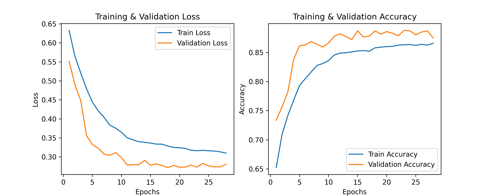

# Polymathic AI Assignment

# Gas State Classification with Vision Transformers(ViT)
This document serves as a guide to structuring the dataset, preprocessing strategies, and different model architectures to explore for the gas state classification task.

## Problem Breakdown & Challenges

### Data Structure and Data Distribution
- The dataset consists of **two channels**:
  1. **Density**: Represents gas density measurements.
  2. **Recording Date**: Represents the date of measurement.
- Each channel is stored as a **28×28 matrix**.
- The value distributions of both channels differ across train, validation, and test sets.
- **Training Set**:
  - The `recording_date` channel contains only **0s or 1s**.
- **Validation Set**:
  - The `recording_date` channel contains values ranging **between 2 and 6**.
- **Test Set**:
  - The `recording_date` channel contains values ranging **between 7 and 9**.

### Challenges
1. **Potential Data Leakage**  
   - The `recording_date` channel might reveal information about the dataset split (train, val, test). Also, The model needs to **generalize** beyond the training distribution to correctly classify gases in the **validation** and **test** sets.

2. **Domain Shift**  
   - The large discrepancy in `recording_date` values between **training** and **other phases** might introduce **domain shift**, making it harder for the model to generalize effectively.

---

## Approach & Model Selection

The following pipeline is recommended:

### 1. Data Preprocessing
- Normalize **each channel independently**.
- Since `recording_date` acts more like a **categorical indicator** rather than a **feature that generalizes across splits**, consider the following strategies:
  - **Option 1**: Remove `recording_date` altogether (check if it improves performance).
  - **Option 2**: Convert `recording_date` into a **one-hot encoding**  (i.e., instead of a single number per pixel, create separate channels for each possible date).
  - **Option 3**: Treat `recording_date` as an **auxiliary input** rather than an image-like feature.  
    - Instead of feeding it as a spatial map, process it separately and integrate it into the model differently (e.g., concatenation at a later layer).

---

## 2. Model Architectures

### (a) CNN-based Model (Small Convolution)
A lightweight CNN with **batch normalization**:
- **Input**: `(2, 28, 28)` (both channels stacked)
- **Convolutional Layers**: 2-3 layers with **3×3 filters**, **BatchNorm**, and **ReLU activation**.
- **Global Average Pooling** to reduce spatial dimensions.
- **Fully Connected Layer** for binary classification.

---

### (b) Transformer-based Model (Vision Transformer)
A Vision Transformer (ViT)-like approach:
- **Flatten** each **28×28** patch into tokens.
- **Embed tokens** and pass them through a **ViT-like encoder** with **small patch embeddings** (**4×4 patches**).
- Use a **classifier head** on the final token embeddings.

---

### (c) ViT + RNN + DNN (Other possible solution)
it might be useful if you **flatten `recording_date` into a temporal sequence**:
- **Process `density`** using **CNN layers**.
- **Concatenate `recording_date`** as an extra feature or encode it using an **RNN** before merging with CNN output.
- **Final classifier head** with a dense layer.

---

## 3. Training Plot

